# 把你的作品放上網:GitHub 三步驟實戰

> 本章目標:把一個 `index.html` 放上 GitHub,並用 GitHub Pages 取得一個任何人都能打開的網址。
> 全程只需要:一個 GitHub 帳號、裝好 Git for Windows、一個放了 `index.html` 的資料夾。
>
> **截圖說明**:本章所有截圖拍攝於 2026-09-02,GitHub 介面日後可能改版;若你看到的畫面跟截圖不完全一樣,請以「按鈕上的文字」為準去找,位置可能移動但名稱通常不變。

---

## 開始之前:你需要準備的三樣東西

| 準備項目 | 怎麼確認 |
|---|---|
| GitHub 帳號 | 能登入 https://github.com 就算完成 |
| Git for Windows | 開「命令提示字元」打 `git --version`,有出現版本號(見下方第二步的第 1 張圖)就算完成 |
| 一個資料夾,裡面有 `index.html` | 本章用的範例資料夾叫 `github-tutorial-demo`,你可以用自己的遊戲檔案 |

> ⚠️ **還沒裝 Git 的人**:請先到 https://git-scm.com/download/win 下載安裝,安裝精靈一路按「Next」用預設值即可。
> 裝完後**重新開一個新的命令提示字元視窗**,舊視窗不會認得新裝的 git。
>
> 【待補】安裝精靈的逐頁截圖(本次錄製的電腦已裝好 Git,無法重現安裝畫面)。

---

## 第一步:在 GitHub 建立一個空的 Repository

Repository(常簡稱 repo)就是「一個專案的家」。我們先在 GitHub 上蓋一個空的家,等一下再把檔案搬進去。

### 1-1 登入 GitHub,點右上角的「+」

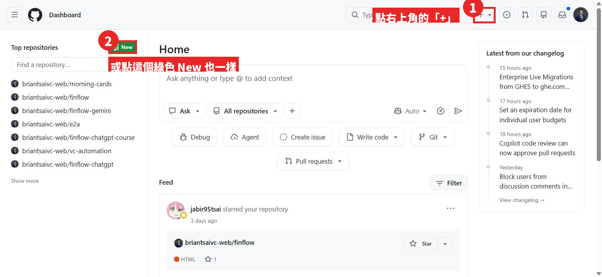

登入後會看到你的首頁(Dashboard)。右上角有一個「+」號,左邊也有一個綠色的「New」按鈕,兩個都可以。

### 1-2 選「New repository」

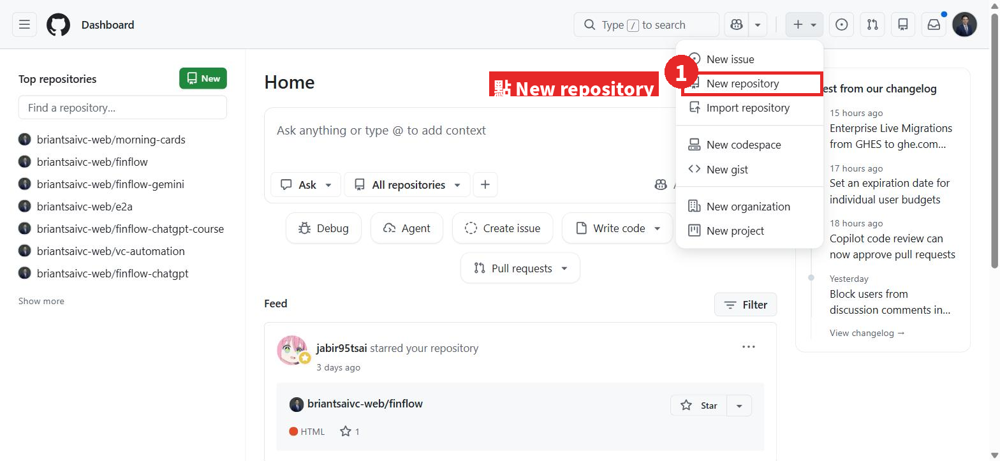

### 1-3 填專案名稱

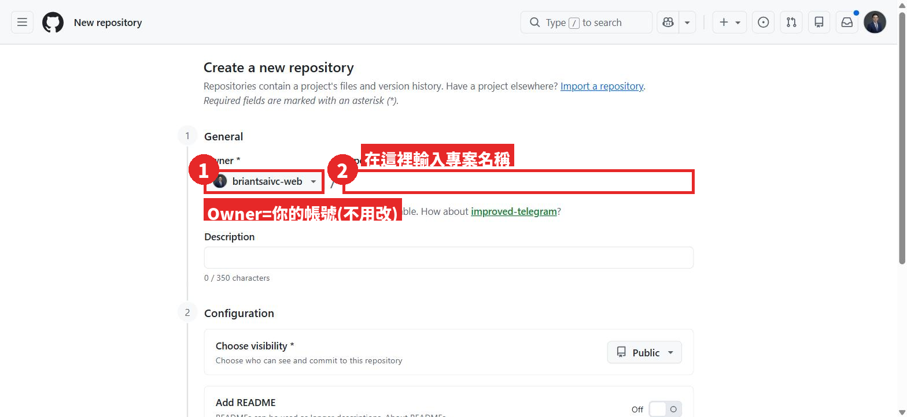

- **Owner**:就是你的帳號,不用動。
- **Repository name**:專案名稱,本章用 `github-tutorial-demo`。只能用英文、數字、`-`,不要有空格。

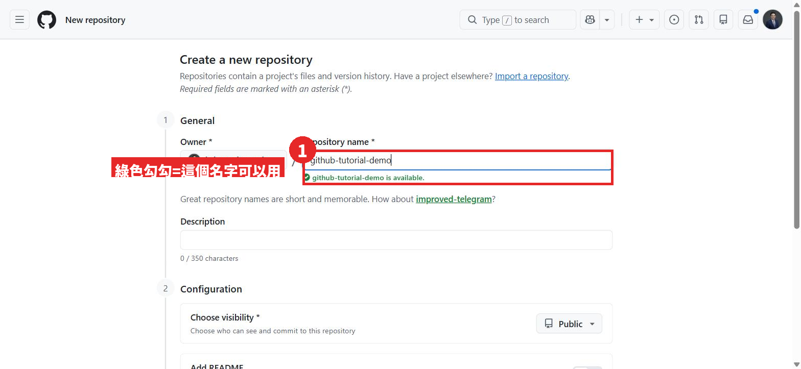

打完名字後,下面出現綠色勾勾「is available」,代表這個名字可以用。

### 1-4 下半部的設定:全部保持預設,直接按 Create

往下捲,你會看到幾個選項。**本章全部維持預設值**:

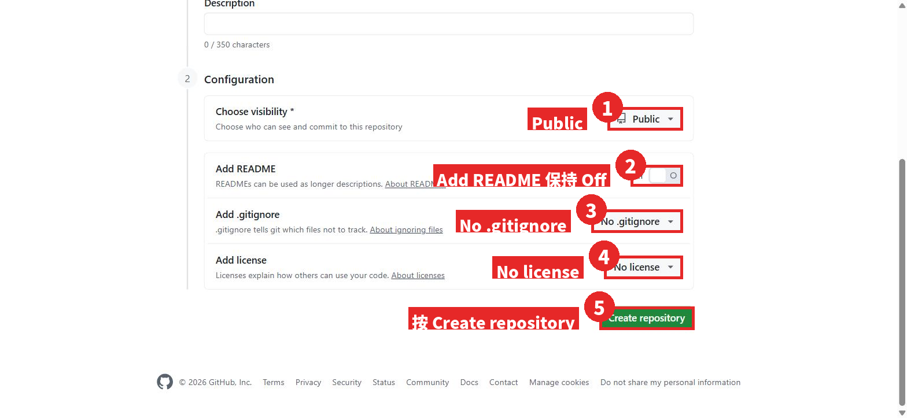

| 項目 | 設定 | 為什麼 |
|---|---|---|
| Choose visibility | **Public** | GitHub Pages 免費版只給 Public 的 repo 用 |
| Add README | **Off**(不要開) | 我們等一下要從電腦推檔案上來,repo 越空越不會出錯 |
| Add .gitignore | **No .gitignore** | 同上 |
| Add license | **No license** | 同上 |

確認後按綠色的 **Create repository**。

### 1-5 建好了:記下你的 Repository 網址

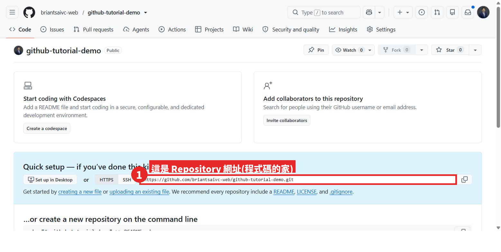

建好後會看到這一頁。中間藍色區塊裡的網址就是你這個專案的網址,格式是:

```
https://github.com/你的帳號/github-tutorial-demo
```

再往下捲,GitHub 已經把等一下要在指令列打的指令準備好了(先看一眼就好,第二步會帶你打):

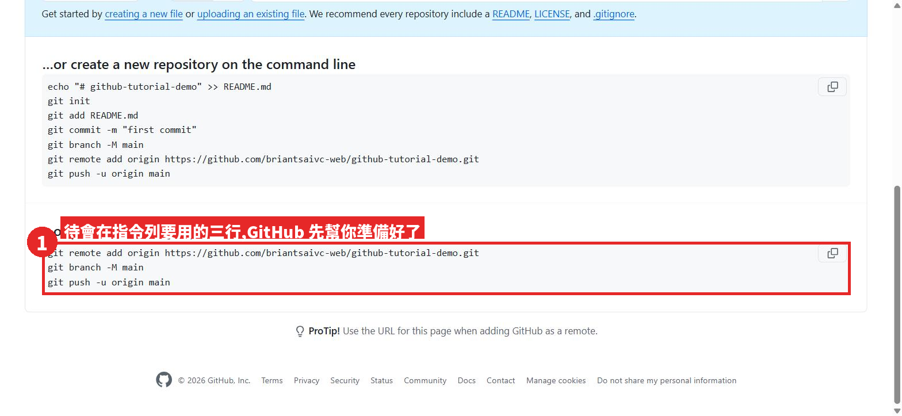

> 💡 **兩個網址別搞混**
> `github.com/你的帳號/專案名` 是「程式碼的家」(給你自己看、給 AI 看)。
> 第三步做完會拿到另一個 `你的帳號.github.io/專案名`,那才是「給別人玩的網址」。

---

## 第二步:用命令提示字元把檔案推上去

### 2-0 打開命令提示字元

按鍵盤上的 Windows 鍵,直接打 `cmd`,按 Enter,會跳出一個黑色視窗,這就是「命令提示字元」。

> 本章的黑色視窗截圖標題都是「命令提示字元」。如果你是從開始功能表點「Git CMD」進來的,畫面一模一樣,指令也一樣。

### 2-1 先確認 Git 裝好了

```
git --version
```

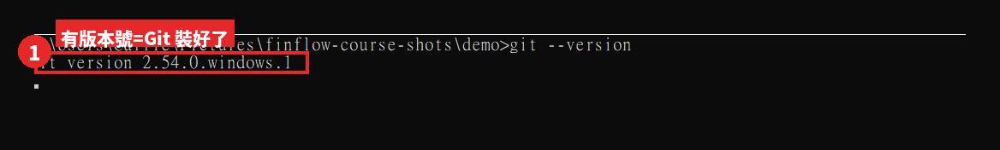

看到 `git version 2.xx.x.windows.x` 之類的版本號就對了。

> ⚠️ **如果你看到的是這個**
>
> 
>
> 「'git' 不是內部或外部命令」= 電腦還沒裝 Git,或是裝完沒有重開視窗。回到「開始之前」那一段先把 Git 裝好。

### 2-2 切換到你的資料夾,初始化 Git

先用 `cd` 走進放 `index.html` 的資料夾(下面的路徑請換成你自己的),然後打 `git init` 和 `git branch -M main`:

```
cd /d "%USERPROFILE%\Downloads\github-tutorial-demo"
git init
git branch -M main
```

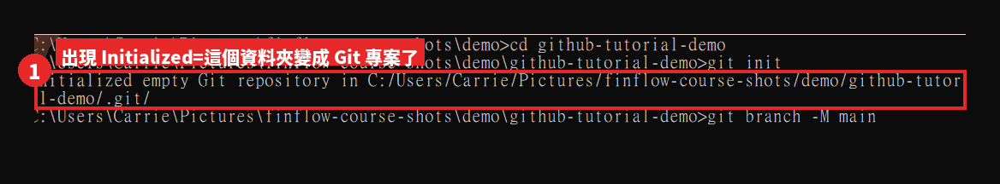

出現 `Initialized empty Git repository`,代表這個資料夾現在是一個 Git 專案了。`git branch -M main` 是把主分支命名為 `main`(GitHub 預設就叫這個名字,先照打就對了)。

> 💡 截圖裡的路徑是錄製時用的 `C:\Users\Carrie\Pictures\...`,你的會不一樣,這是正常的。

### 2-3 把檔案加進來,建立第一個存檔點(commit)

```
git add .
git commit -m "第一次上傳:加入 index.html"
```

`git add .` 是「把資料夾裡所有檔案排進這次要存的清單」,`git commit -m "說明"` 是「正式存一個存檔點,並寫一句說明」。

> ⚠️ **第一次用 Git 幾乎一定會遇到這個錯誤**
>
> 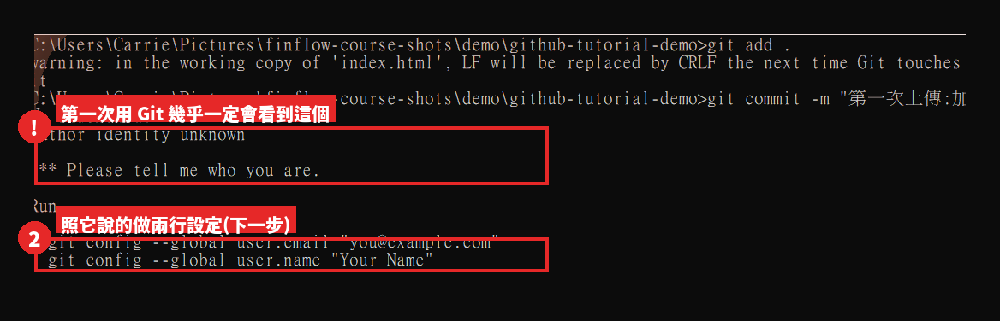
>
> `Author identity unknown / Please tell me who you are` 不是你打錯,是 Git 第一次使用需要知道「這台電腦的存檔要署名誰」。照它說的打兩行設定(名字和 email 填你自己的,email 不一定要跟 GitHub 帳號一樣,但一樣最省事):
>
> ```
> git config --global user.name "Brian Tsai"
> git config --global user.email "brian@example.com"
> ```
>
> 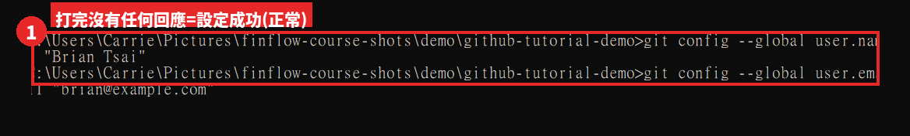
>
> 這兩行**打完不會有任何回應**,那就是成功。設定只需要做這一次,以後在這台電腦都不用再打。設定完,再打一次上面的 `git commit -m "..."`。
>
> 順帶一提,截圖裡那行 `warning: ... LF will be replaced by CRLF` 是 Windows 換行符號的提醒,**可以無視**。

成功會長這樣:

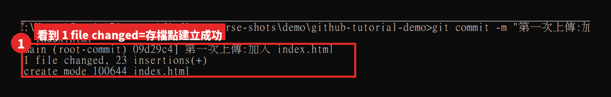

`1 file changed` = 一個檔案被存進存檔點了。

### 2-4 告訴 Git 要推去哪裡,然後推上去

把下面的網址換成你在 1-5 記下的 Repository 網址(結尾要加 `.git`):

```
git remote add origin https://github.com/briantsaivc-web/github-tutorial-demo.git
git push -u origin main
```

`remote add origin` 是「幫這個遠端倉庫取個綽號叫 origin」,`push` 就是真的把檔案上傳。

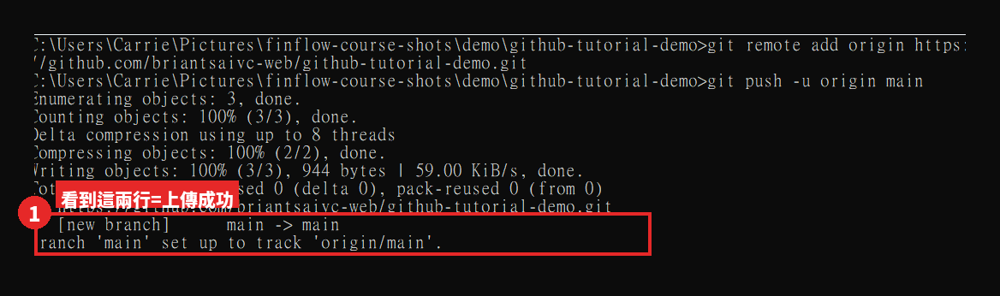

看到最後兩行 `* [new branch] main -> main` 和 `branch 'main' set up to track 'origin/main'`,代表上傳成功。

> ⚠️ **第一次 push 可能會跳出一個登入視窗**
> Git 第一次連 GitHub 時,Windows 會跳出「Git Credential Manager」的視窗,要你用瀏覽器登入 GitHub 並授權。這**不是當機**,照著登入即可,以後就不會再問。
>
> 【未截圖】錄製用的電腦先前已登入過,這次沒有跳出視窗,所以沒有這一步的截圖。如果你遇到,畫面大致是一個標題「Connect to GitHub」的小視窗,選「Sign in with your browser」。

---

## 第三步:啟用 GitHub Pages,拿到你的網址

### 3-1 回到 GitHub,確認檔案已經上去了

重新整理你的 Repository 頁面,應該會看到 `index.html` 出現在檔案列表裡:

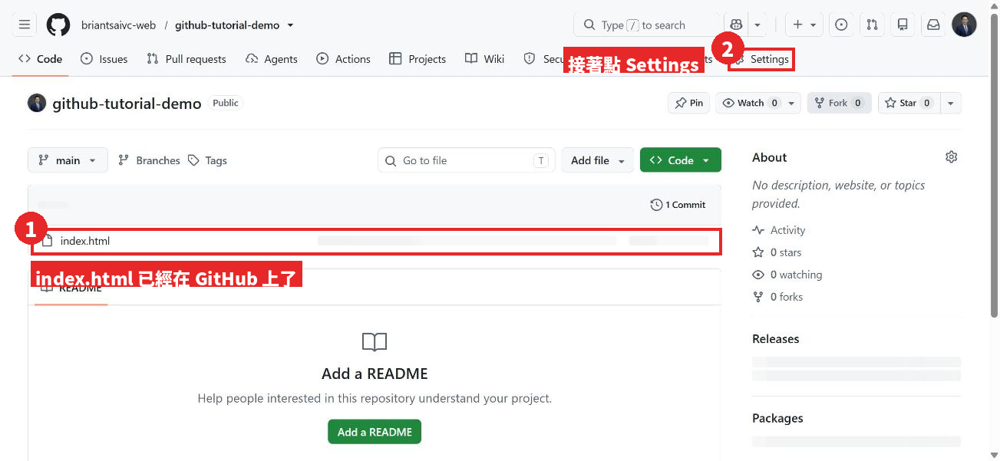

接著點右上方的 **Settings**(齒輪圖示)。

### 3-2 左邊選單找到 Pages

Settings 頁面左邊有一長串選單,往下捲,在「Code, planning, and automation」那一區找到 **Pages**:

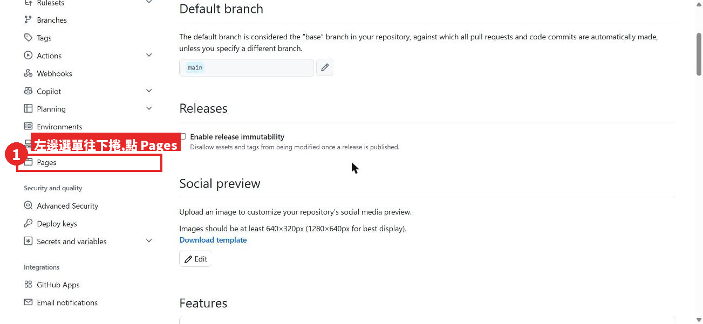

### 3-3 設定 Branch 為 main,按 Save

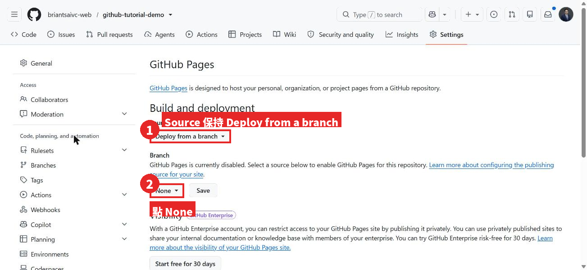

- **Source** 保持 `Deploy from a branch`。
- **Branch** 現在是 `None`,點它。

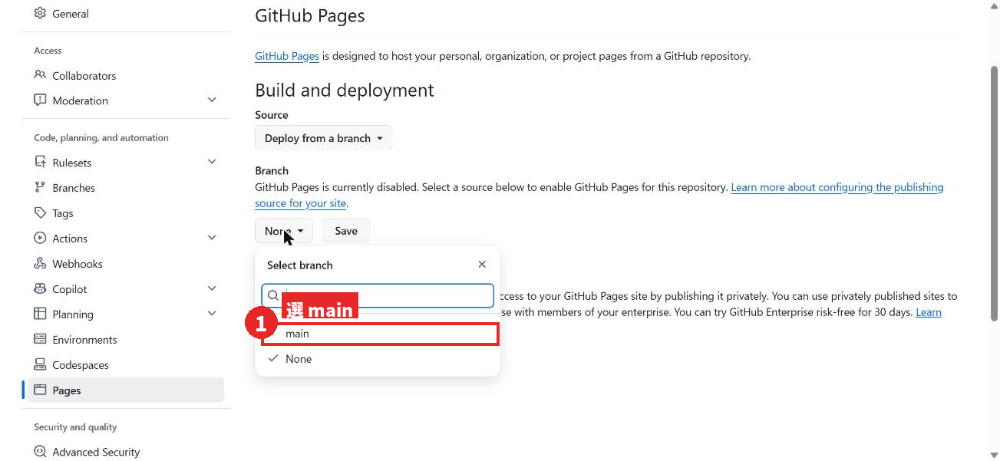

選 `main`。

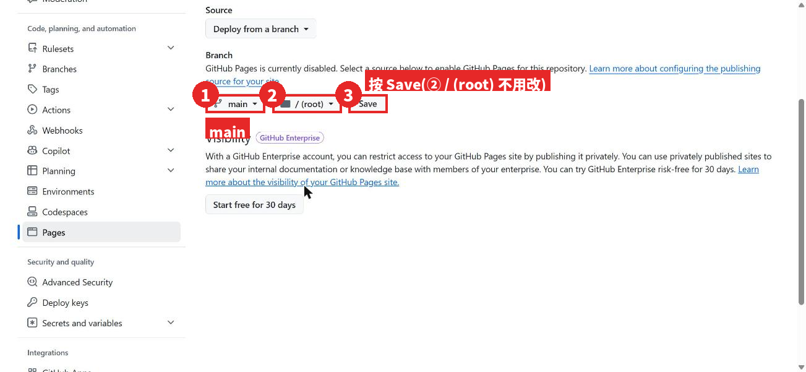

旁邊會多出一個資料夾選項,保持 `/ (root)`,然後按 **Save**。

> 💡 **關於 `gh-pages`**:有些教學會叫你選 `gh-pages` 分支。那是專案裡有設定自動建置(GitHub Actions workflow)時才會出現的分支。本章這種「資料夾裡直接放 `index.html`」的專案,選 `main` 就對了;下拉選單裡沒有 `gh-pages` 是正常的。

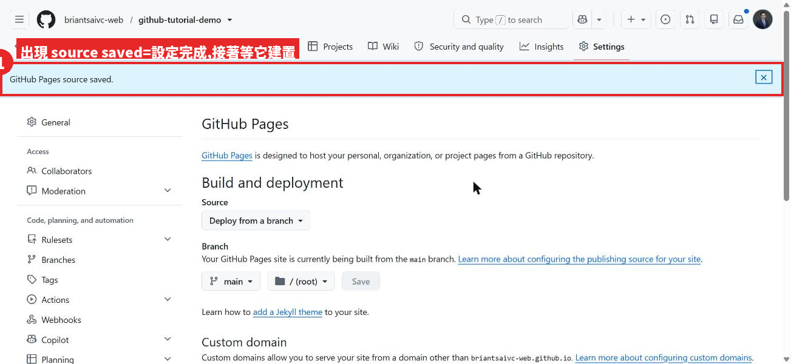

上方出現藍色的 `GitHub Pages source saved.`,設定完成。

### 3-4 等 GitHub 幫你建置(1~2 分鐘)

按 Save 之後 GitHub 會在背景把網站「蓋」出來。你可以點上方的 **Actions** 分頁看進度:

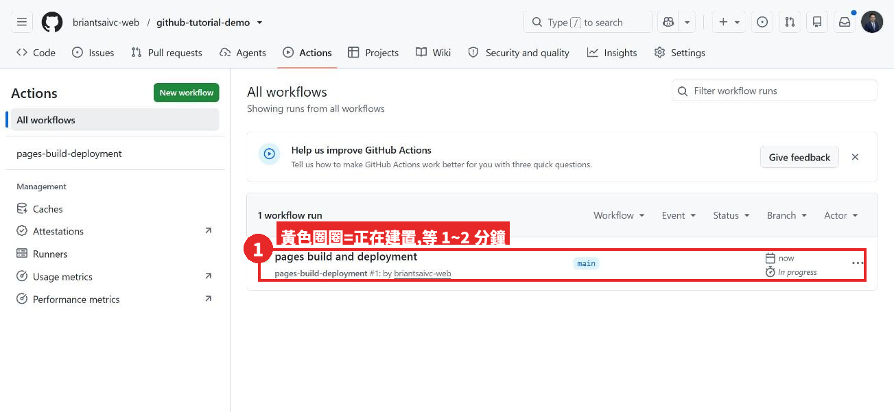

黃色圈圈 = 正在建置。等一下再重新整理:

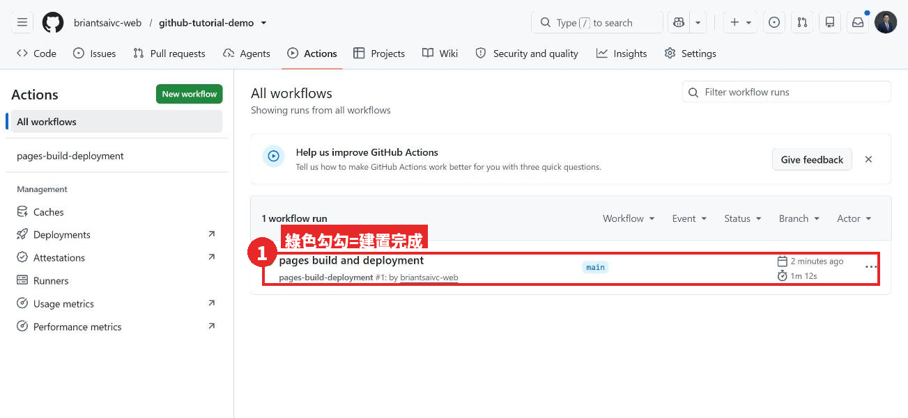

綠色勾勾 = 完成(本次錄製花了 1 分 12 秒)。

### 3-5 拿到網址,打開你的作品

回到 Settings → Pages,上方會多出一個框:

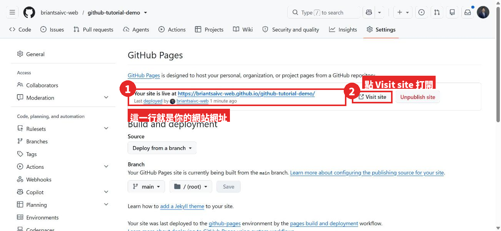

`Your site is live at https://你的帳號.github.io/github-tutorial-demo/` 這一行就是你的網址。點 **Visit site**:

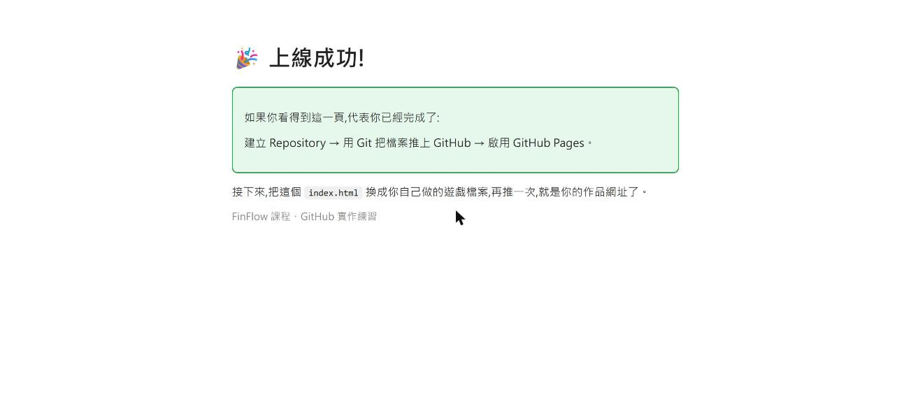

看到這一頁,恭喜你,你的作品已經在網路上了,把網址傳給朋友就能打開。

> 💡 如果點開是 404:再等一分鐘重新整理。如果等了五分鐘還是 404,回 Actions 看有沒有紅色叉叉,通常是資料夾裡沒有 `index.html`(檔名要一模一樣,小寫)。

---

## 之後怎麼更新?只要三行

以後改了 `index.html`,回到命令提示字元、走進同一個資料夾,打這三行就會更新網站(GitHub 會自動重新建置,一樣等 1~2 分鐘):

```
git add .
git commit -m "寫一句這次改了什麼"
git push
```

這就是 GitHub 當「存檔點/時光機」的用法:每一次 commit 都是一個可以回去的存檔。

---

## 本章指令總整理(可直接複製)

```
git --version
cd /d "%USERPROFILE%\Downloads\github-tutorial-demo"
git init
git branch -M main
git add .
git commit -m "第一次上傳:加入 index.html"
git remote add origin https://github.com/你的帳號/github-tutorial-demo.git
git push -u origin main
```

第一次使用 Git 另外要打一次(以後不用):

```
git config --global user.name "你的名字"
git config --global user.email "你的email"
```

---

## 附錄:本章截圖來源與誠實揭露

- 截圖日期:2026-09-02。GitHub 帳號:briantsaivc-web,練習用 repo:`github-tutorial-demo`(真實建立、真實推送、真實上線,網址 https://briantsaivc-web.github.io/github-tutorial-demo/)。
- 第二步的黑色視窗截圖,實際是在「Git CMD」視窗中執行並把標題改為「命令提示字元」,兩者指令與畫面完全相同;這樣做是為了讓讀者看到的標題跟自己開的視窗一致。
- 2-3 的「Author identity unknown」錯誤畫面,是在錄製電腦上以「暫時清空 Git 全域設定」的方式重現的真實錯誤輸出,不是合成圖。
- 2-3 的 `git config` 那張圖,錄製時只顯示指令未真正覆寫錄製者的設定(該指令本來就沒有輸出,畫面與真實執行相同)。
- 未取得的截圖:Git for Windows 安裝精靈、第一次 push 的登入視窗(錄製電腦已有登入憑證)。這兩處以文字說明代替,並標【待補】/【未截圖】。
