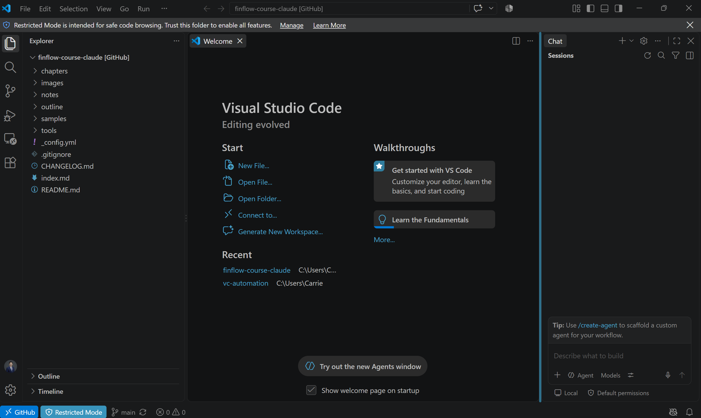

# 同一件事的三種做法：命令提示字元、VS Code、瀏覽器裡的 VS Code

> 本節目標：讓你知道 add／commit／push 三步除了打指令，還有兩種介面可以選；以及三種做法在做的是同一件事。
> 這是第二部的補充，不是作業。命令提示字元版你已經會了，它不會消失。
> 事實查證日期 2026-09-08；VS Code 與 GitHub 的介面會變，請以按鈕上的文字為準。

---

## 你已經會的三步

GitHub 章教的三行指令，白話就是：**挑檔案**（`git add .`）、**蓋存檔點並寫一句改了什麼**（`git commit -m "…"`）、**上傳到 GitHub**（`git push`）。這三步是 git 的核心，任何介面都是在幫你按這三個動作。

命令提示字元版有一個特性：`git add .` 是閉著眼睛全收。你改了哪些檔、每個檔改了哪幾行，指令不會主動告訴你——要另外打 `git status`、`git diff` 才看得到。對一個不寫程式、只是決定「AI 改的東西要不要送出去」的人來說，這是最不方便的地方。

---

## 同一件事，換一個介面：VS Code

VS Code 是微軟出的免費編輯器。你不需要用它寫程式；對這個課程來說，它最有用的是左側的 **Source Control 面板**。

| 命令提示字元 | VS Code 的 Source Control 面板 | 多了什麼 |
|---|---|---|
| `git add .` | 每個改過的檔旁邊按「＋」，或 Changes 旁的「＋」全收 | 先看到改了哪些檔；點任一個檔，逐行紅綠對照 |
| `git commit -m "…"` | 上方訊息框打一句話，按 Commit | 有訊息框，不會忘了寫 |
| `git push` | 按 Sync Changes | 順便先把 GitHub 上別人的改動拉下來（pull） |

「改前先看差異」這件事，正是第六部講的「動手門檻」在日常裡的樣子：AI 改了什麼，你一行一行看過，不接受沒看過的改動。

---

## 三種做法對照

除了本機安裝 VS Code，還有一個零安裝的版本：**github.dev**，在瀏覽器裡跑的 VS Code。

| | 命令提示字元 | 本機 VS Code | 瀏覽器 VS Code（github.dev） |
|---|---|---|---|
| 要安裝嗎 | Git | Git ＋ VS Code | 不用，有瀏覽器就好 |
| 看得到逐行差異 | 要打 `git diff` | 點一下 | 點一下 |
| 能執行程式（build、測試） | 可以 | 可以（內建終端機） | 不行，沒有終端機 |
| 預覽投影片（Marp） | 不行 | 可以，裝擴充功能 | 可以，網頁版擴充功能 |
| 匯出 pptx／pdf | 要跑 CLI | 可以 | 不行，瀏覽器跑不了 |
| 適合 | 已經習慣指令的人 | 常改、想看差異、要匯出 | 只改文字、偶爾改、在平板上 |

---

## 瀏覽器版怎麼開

兩個方法，選一個：在 repo 的網址列把 `github.com` 改成 `github.dev`；或者在 repo 頁面直接按鍵盤上的句點鍵 `.`。GitHub 會在同一個分頁打開一個看起來就是 VS Code 的畫面，Source Control 面板一樣在左側，改完一樣是打勾、寫訊息、Commit、Push。

三個限制要記住。第一，沒有終端機，不能執行任何程式——`npm run build`、跑測試都不行，它就是一個編輯器。第二，只能用網頁版的擴充功能；Marp for VS Code 有網頁版，所以可以預覽投影片，但匯出 pptx 不行。第三，也是最重要的：**沒有 commit 之前，你的修改只存在瀏覽器裡**。關掉分頁、換台電腦，就沒了。改完立刻 Commit 加 Push。

---

## 本機版怎麼開

安裝 VS Code 之後，File → Open Folder，選你的 repo 資料夾。第一次打開會看到上方一條藍色的 **Restricted Mode**，這時 git 功能是關的——按 Manage → Trust 之後才會開。然後左側第三個圖示就是 Source Control。

（截圖：作者電腦，2026-09-08，VS Code 開啟本課程的 repo，藍條就是 Restricted Mode。）

---

## 為什麼對這個課程特別有用

第一，改前先看差異。這是品管的基本動作，前面說過了。

第二，投影片即時預覽。本課程 repo 裡的投影片全部是 Marp 格式的 Markdown；裝了 Marp for VS Code 擴充功能之後，檔案右上角會有預覽鈕，改一行馬上看到那一頁長什麼樣，本機版還能直接匯出 pptx。這等於所見即所得。

第三，跟 AI 協作的流程變短。之前的做法是 AI 把檔案打包成 zip，你下載、解壓、放到正確位置、再打指令。有了 VS Code，AI 可以直接把檔案寫進你的 repo 資料夾，你在 Source Control 面板看到變更，看過差異，打勾，Sync。中間那些搬檔案的步驟不見了，而「看過再送」的把關反而更明確。

---

## 踩坑提醒

Source Control 面板是空的、按鈕是灰的：多半是 Restricted Mode 還沒 Trust。

github.dev 改完關掉分頁，東西不見了：未 commit 的修改只存在瀏覽器裡，改完就要 Commit 加 Push。

按 Sync 跳出「合併」或衝突的訊息：Sync 是先 pull 再 push，代表 GitHub 上有你本機沒有的改動。一個人用的 repo 幾乎不會遇到；遇到了把訊息貼給 AI 問怎麼解。

第一次 Push 跳出登入視窗：跟 GitHub 章第一次 push 時一樣，登入 GitHub 帳號即可，之後不會再問。

---

## 要不要裝？

只改文字、偶爾改：瀏覽器版就夠，`.com` 改 `.dev`，零安裝。常改、想看差異、要匯出簡報：裝本機 VS Code，加 Marp 擴充功能。要跑程式（build、測試）：本機 VS Code 有內建終端機（Ctrl+`），或維持命令提示字元也完全可以。

不管選哪個，你做的都是同一件事：挑檔案、蓋存檔點、上傳。

---

## 附：事實來源（2026-09-08 查證）

- GitHub Docs, *The github.dev web-based editor*：開啟方式、可做與不可做、與 Codespaces 的差異、未 commit 修改存於瀏覽器本機。
- marp-team, Discussion #169 *Marp for vscode.dev/github.dev*：網頁版擴充功能可預覽、匯出指令無法在網頁執行。
- 免費額度與付費方案會變動，本節不寫死。
