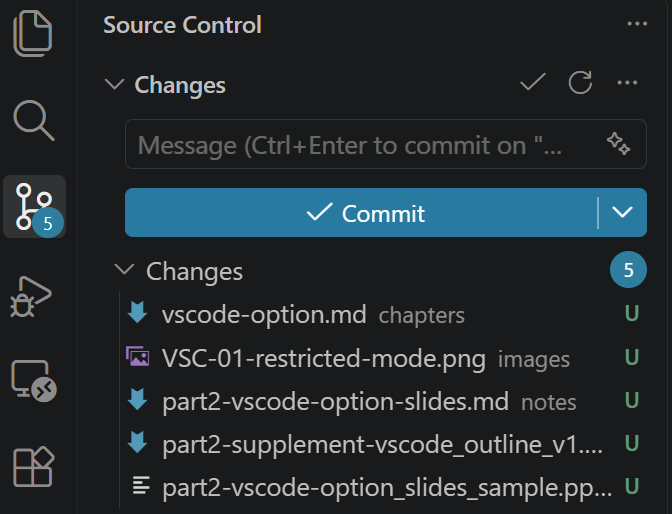
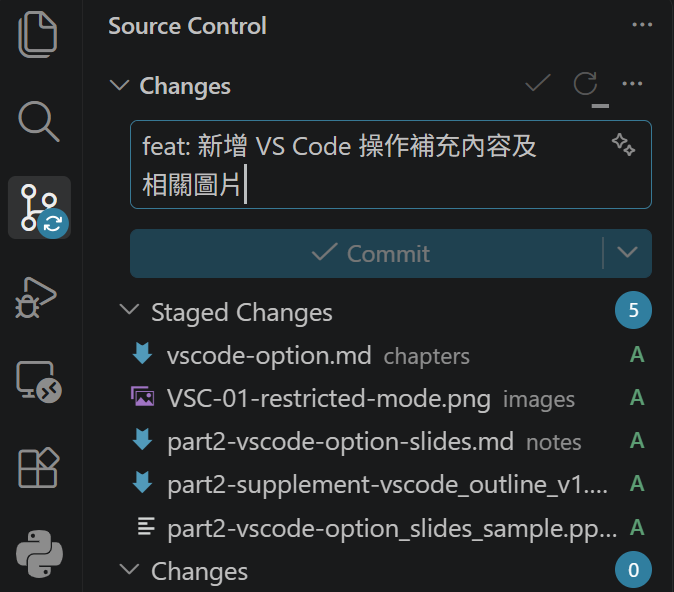

<!-- _class: title -->
# FinFlow 實戰心法
## 一個不會寫程式的人，怎麼用 AI 做出一款財商桌遊

Brian ／ 2026 秋季
六種頁型 × 四套樣板，選一套套用整份課程

---

# 開發模式的典範轉移

<div class="lead">為什麼自己指揮 AI 做，比外包等別人做更划算？</div>

| 比較維度 | 外包或等待工程團隊 | 你親自指揮 AI 疊代 |
| :--- | :--- | :--- |
| **溝通成本** | 需求文件來回往返數週 | 自然語言即時對話修正 |
| **細節掌控** | 工程師常以技術限制回絕 | 核心商業邏輯由你親自拍板 |
| **疊代週期** | 改一版耗時以月為單位 | 5 天完成 20 次版本演進 |

- 判斷標準一句話：<span class="highlight">改錯了要花多少力氣才回得來？</span>

---

# 一個真實的下午：三個 AI、五個 bug

<div class="lead">2026 年 9 月 5 日，FinFlow v2.49.0。我把整套遊戲交給 Gemini 除錯。</div>

<div class="grid">
  <div class="box">
    <strong>Gemini 交出報告</strong><br>
    5 個 bug、5 段修改碼<br>
    <i>「已在沙盒實際執行」</i>
  </div>
  <div class="arrow">➔</div>
  <div class="box blue">
    <strong>Claude 逐條覆驗</strong><br>
    在我的電腦上實跑 24,000 局<br>
    <i>不是再讀一次，是真的跑</i>
  </div>
  <div class="arrow">➔</div>
  <div class="box red">
    <strong>結果</strong><br>
    3 真・1 半真・1 機制寫錯<br>
    <i>修改碼 4 段不能照抄</i>
  </div>
</div>

- 我一行程式都沒看懂，但我能判斷誰對——因為我要求每一方拿出證據

---

# 三種提示詞（複製就能用）

<div class="lead">問法決定答案品質。三個階段三種問法。</div>

<div class="grid">
  <div class="box blue">
    <strong>① 盲審</strong><br>
    「請審查這份程式。每個問題附：嚴重度、<b>第三者能照做的重現步驟</b>、位置、一句話修法。<b>不要改檔</b>。」
  </div>
  <div class="box">
    <strong>② 裁決</strong><br>
    「這是 A 的審查報告。<b>逐條實際執行</b>驗證，分真／半真／假。附你的執行紀錄。」
  </div>
  <div class="box red">
    <strong>③ 反向質詢</strong><br>
    「<b>不要告訴我你同不同意</b>。請核對原始碼，逐條說它對或不對，附行數。」
  </div>
</div>

> 三句共同的底線：附證據、不改檔、不確定就說不確定

---

# 你已經會的三步：命令提示字元版

<div class="lead">GitHub 章教的那三行，其實就是「挑檔案 → 存檔點 → 上傳」。</div>

```
git add .
git commit -m "第六部 v1.1：精簡為 10 頁"
git push
```

- `git add .` 閉著眼睛全收；`git commit` 蓋存檔點；`git push` 才上傳到 GitHub
- 接下來教的只是**同一件事，換一個介面**

---

# 實際長這樣：打勾、寫訊息

 

- 左：改了 5 個檔（U＝新檔），藍色 **Commit** 就是 `git commit`
- 右：按 ＋ 之後變 **Staged Changes**（＝`git add`）；打一句話，這時才按 Commit
